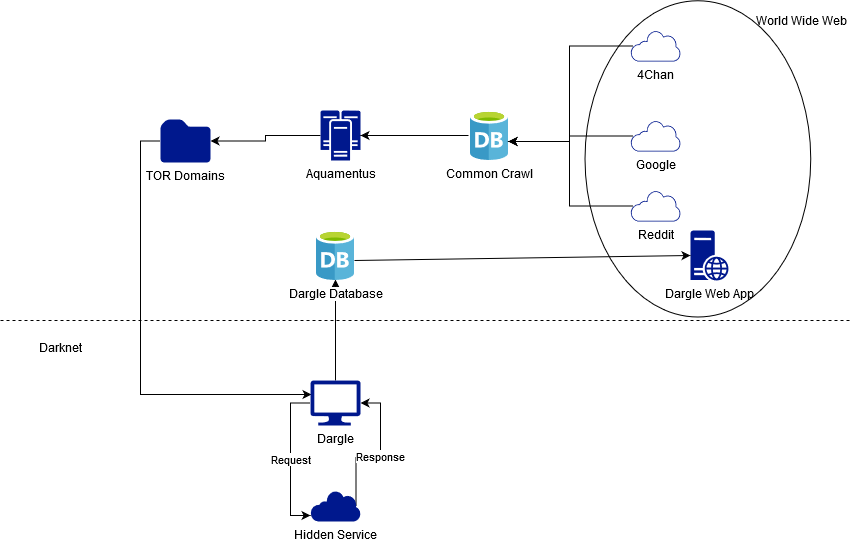

# Dargle
The Open-Sourced Dark Web Search Engine

## Project Summary
1. The Dark Web is notoriously difficult to crawl. The Hidden Services directory, which users use to find hidden services, stores hashes of domains to prevent enumeration. Hidden services, the web sites hosted on the DarkNet, are not highly connected through hyperlinks like sites on the clearweb, diminishing the ability of crawlers to index the Dark Web. All users must have a priori knowledge of a hidden service URL. Typically, users obtain these URLs from websites on the clearweb. This project aims to create a Dark Web crawler by automating the process of finding hidden service URLs on the clearweb. Current efforts are hand-curated and do not reflect the current status of hidden services on the Dark Web or are not open-sourced. 

2. This research proposal aims to:

    1.	Extract all hidden service URLs (i.e. .onion) from the Common Crawl corpus.  
    2.	Automatically determine the state of each URL (e.g. up, down, non-existent).
    3.  Create an interface for searching through indexed hidden service URLs.  

## How to Use this App

- Ensure you have SQLAlchemy, Flask, SQLite3, and Python installed
- Navigate to `dargle/dargle_proc`
- Run the command `python app.py`

## Files & Purpose
```
 /dargle_webapp/models.py                : creates classes for database tables
 /dargle_webapp/routes.py                : creates and handles webpages for Flask
 /dargle_webapp/tables/                  : holds .html templates for Flask app

 /dargle_webapp/workflow/autorun.py      : kicks off connection to addresses 
 /dargle_webapp/workflow/request.py      : handles connecting to addresses and grabs information 
 /dargle_webapp/workflow/dargle_orm.py   : handles translation from Python objects to SQLite3 database
```

## Grand Unified Diagram


## TODO List (No order/priority)
1. Use beautifulsoup to pull more information from landing pages
2. Add recursive connection:
    - Attempt to connect to every domain with 10s timeout timer
    - After first pass, attempt connection again with, for example, 20s timeout timer
    - Continue this process untill timeout timer is at its max value - 120s
    - Update the DB to reflect
3. Add crawling capabilities using information grabbed from landing pages
4. Update site for better UIX and User Experience
